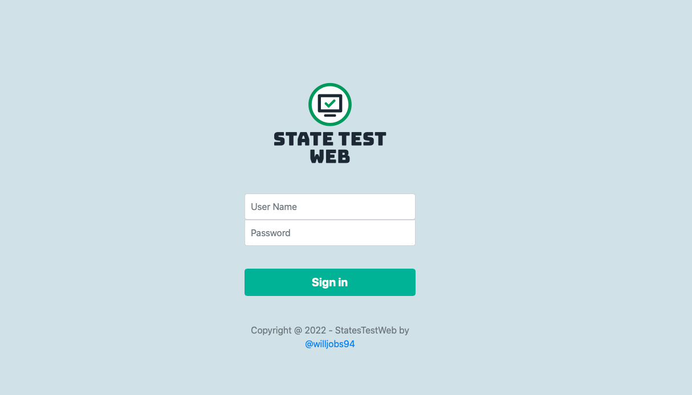
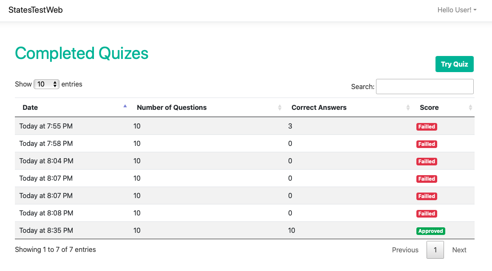
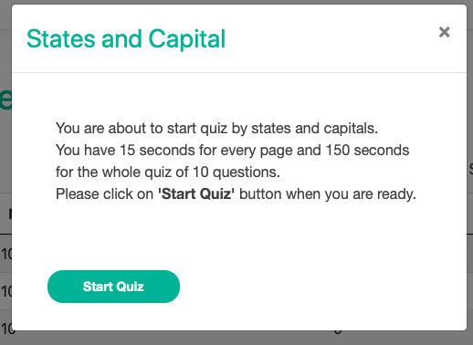

# The System

A State Quiz application that allows a user to login and take several test to assest their 
knowladge about capital from USA states.

# The approach 

Since this is a basic application base on a Database structure provided in the exersice 
I wanted to show as many skills as posible, such as:

* N Layer arquitecture
* Repository Pattern
* Code-First migration that is homogenous to the tables structure provided
* Integration with existing libraries (AutoMapper, SurveyJs, DataTables)
* Design of custom helper to create specific data structure e.g: (QuizBuilder) class
* Cross platform funcitonality, hence the use of .net core (WebApp) and docker to run
  (MS SQL Server on mac)
* Use of multples IDE, Visual Studio on Windows, Rider on Mac.

# Preview

### Login

### Completed Quizes List

### Try Quiz Modal

